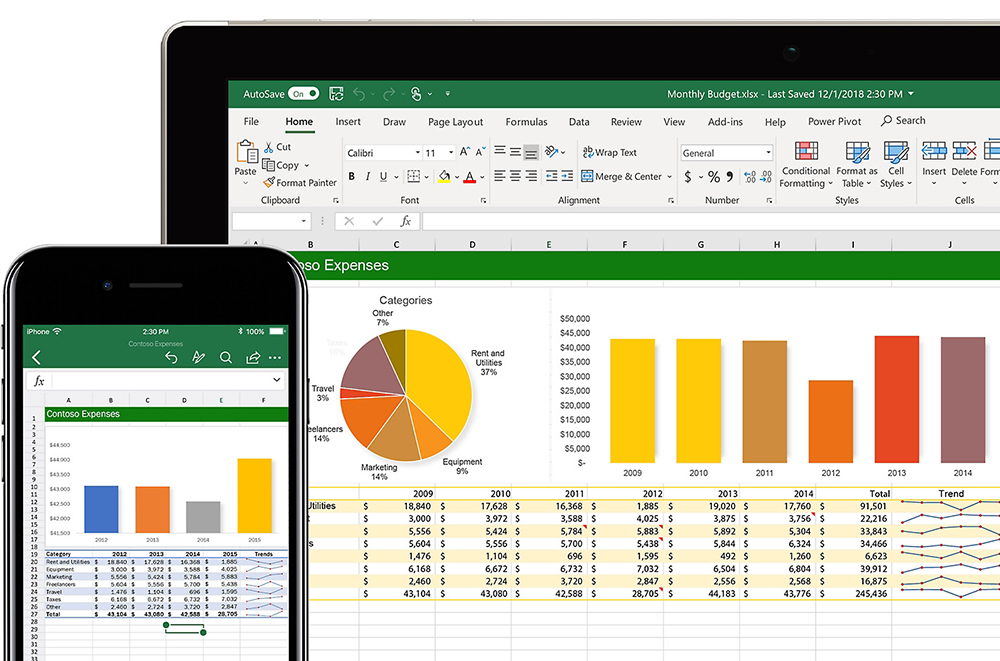

# 🧩 Life Operating System (LifeOS)

Life Operating System (LifeOS) is a collection of Microsoft Excel template for personal budgeting, accounting, decision making, etc.

## 💲 [Finance](templates/finance)
- [Personal Income Tracker (PIT)](https://github.com/agung2001/life-operating-system/blob/d07f49c48557291bdd4fc6741f9159733ef38c49/templates/finance/Personal%20Income%20Tracker%20(PIT).xlsx)
- [Personal Spending Tracker (PST)](https://github.com/agung2001/life-operating-system/blob/c6319abe7f6b5c4101691d181e9cf1c78893ca88/templates/finance/Personal%20Spending%20Tracker%20(PST).xlsx)

## 💼 [Management](templates/management)
- [Balance Scorecard (BSC)](https://github.com/agung2001/life-operating-system/blob/3897377aca317fa72edab65a61139225c355f428/templates/management/Balance%20Scorecard%20(BSC).xlsx)

## ⭐️ Support & Contribution
- Help support me by giving a 🌟 or [donate][website]

[website]: https://agung2001.github.io